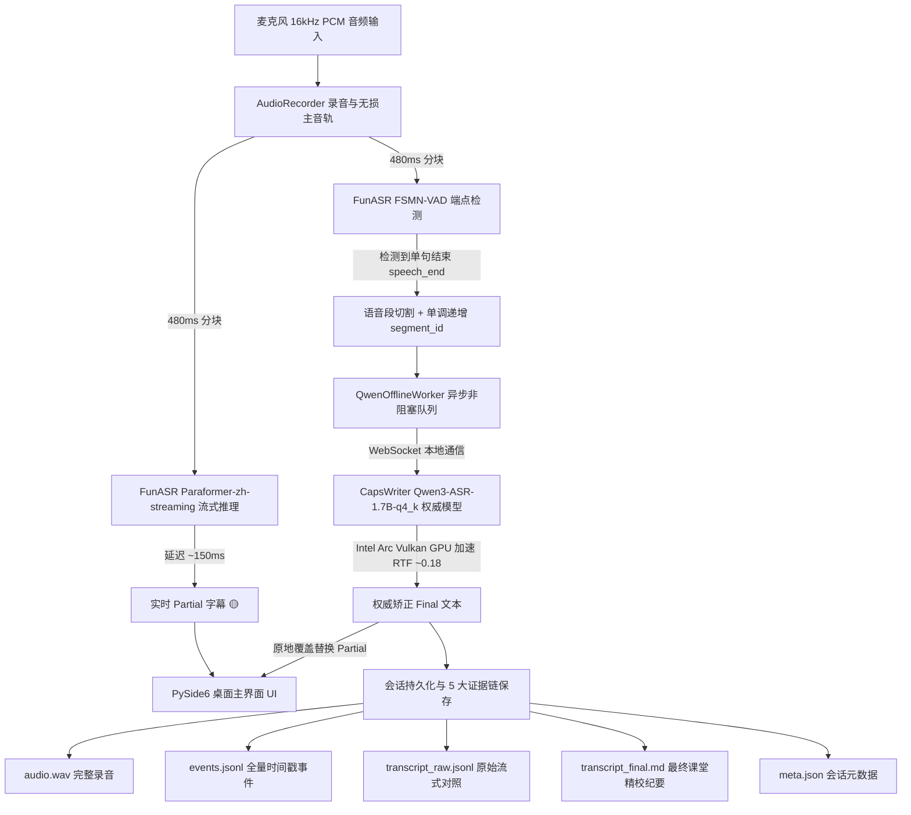

# 课堂实时转写系统 (Hybrid 2-Pass Real-Time Classroom ASR)

一个专为 Windows 打造的低延迟、高准确率“混合 2-Pass 课堂实时语音转写”桌面应用。

---

## 🌟 核心设计理念 (Hybrid 2-Pass)

1. **第一遍追速度（流式 Partial 字幕）**：
   - 麦克风 16kHz 音频流 → **FunASR Paraformer-zh-streaming** (CPU 推理)
   - 480ms chunk，单块延迟 ~150ms，以瀑布流形式立即在 UI 展示实时 Partial 字幕（黄色标签）。
2. **第二遍保准确（离线 Final 权威纠错）**：
   - 说话停顿由 **FunASR FSMN-VAD** 自动检测断句并切分单句音频段。
   - 异步送入 **Qwen3-ASR-1.7B-q4_k**（基于 Intel Arc 140T Vulkan GPU 硬件加速，RTF ~0.18）。
   - 将该句的实时 Partial 字幕**精准原地覆盖替换**为权威定稿（绿色标签）。
3. **多线程异步解耦与单调序列保护**：
   - 录音、VAD、流式识别与 Qwen 离线纠错完全在独立线程中运行，录音与 UI 永不卡顿。
   - 采用单调递增 `segment_id` 防止乱序错位。
4. **5 大完整交付物与证据链存证**：
   - 每次课堂结束后自动保存：
     - `audio.wav`：16kHz 16-bit 单声道无损录音母带。
     - `events.jsonl`：逐毫秒记录的录音、VAD切分、流式输出、离线替换全量事件链。
     - `transcript_raw.jsonl`：流式中间文本 vs Qwen 最终纠错文本对比。
     - `transcript_final.md`：带 `[HH:MM:SS]` 精确时间戳的结构化 Markdown 课堂笔记。
     - `meta.json`：会话元数据（课程、时长、模型版本、硬件配置等）。

---

## 🏗️ 架构流程图



---

## 📁 目录结构

```text
├── app/
│   ├── audio/              # sounddevice 音频录制与音频分发器
│   │   └── recorder.py
│   ├── config.py           # 全局配置、硬件参数与路径定义
│   ├── courses/            # 课程与专业词库管理
│   │   └── course_manager.py
│   ├── offline/            # Qwen3-ASR 适配器与异步任务队列
│   │   ├── qwen_adapter.py
│   │   └── qwen_worker.py
│   ├── pipeline/           # 2-Pass 流水线主调度器与文档生成
│   │   └── session_manager.py
│   ├── streaming/          # Paraformer 流式识别器
│   │   └── paraformer_streamer.py
│   ├── ui/                 # PySide6 现代桌面界面
│   │   └── main_window.py
│   ├── vad/                # FunASR FSMN-VAD 端点检测器
│   │   └── vad_detector.py
│   └── main.py             # 应用程序启动入口
├── courses/                # 预设课程配置与热词文件
│   ├── microeconometrics/
│   ├── political_economy/
│   └── stata/
├── launcher/               # Windows 启动脚本与桌面快捷方式生成器
│   ├── create_shortcut.py
│   └── run_app.bat
├── tests/                  # 自动化验证与验收测试套件
│   ├── audio_samples/      # 验收测试音频样本
│   ├── test_full_2pass_pipeline.py
│   ├── test_full_acceptance.py
│   ├── test_qwen_adapter.py
│   └── test_streaming_standalone.py
├── requirements.txt
└── README.md
```

---

## 🚀 运行方式

### 方式 1：Windows 桌面快捷方式
在桌面双击 **`课堂实时转写.lnk`** 即可直接启动桌面 GUI。

### 方式 2：批处理脚本启动
在 Windows 资源管理器中双击 `launcher\run_app.bat`。

### 方式 3：Python 命令启动
```bash
# 激活虚拟环境
.venv\Scripts\activate

# 启动主程序
python app/main.py
```

---

## 🧪 自动化验收测试

运行全量综合验收测试套件：
```bash
python tests/test_full_acceptance.py
```

### 测试指标与结果
- **Test 1: Course Manager**：课程分类与专业词库解析（PASSED）
- **Test 2: 2-Pass Pipeline**：Paraformer 实时 partial + Qwen 最终替换（PASSED）
- **Test 3: Sequence Integrity**：句子段落单调递增 `segment_id` 无乱序（PASSED）
- **Test 4: File Artifacts**：5 大核心交付文件完整生成（PASSED）
- **Test 5: Zero Re-download**：本机 Qwen3-ASR 本地模型复用（PASSED）
