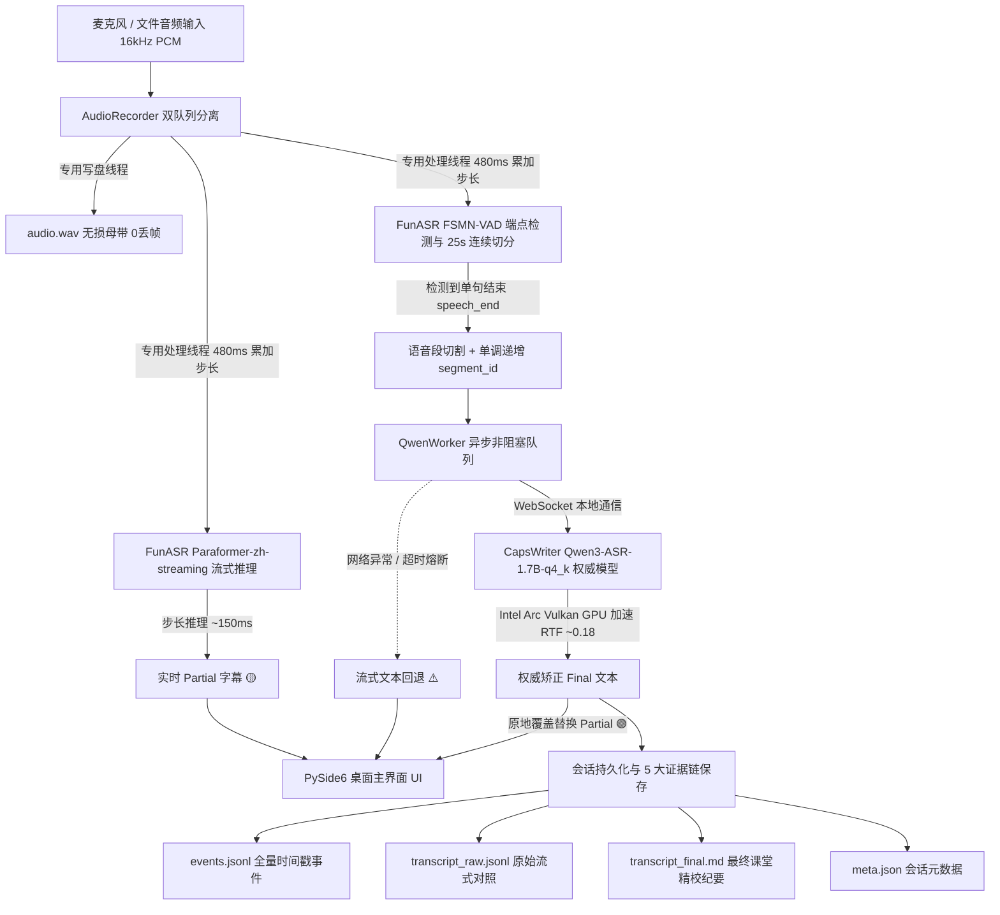

# 课堂实时转写系统 (Hybrid 2-Pass Real-Time Classroom ASR)

一个专为 Windows 打造的低延迟、高准确率“混合 2-Pass 课堂实时语音转写”桌面应用。

---

## 🌟 核心设计理念 (Hybrid 2-Pass)

1. **第一遍追速度（流式 Partial 字幕）**：
   - 麦克风 16kHz 音频流以 100ms (1600 samples) 块摄入，由内部 **480ms (7680 samples) 步长累加器**驱动 **FunASR Paraformer-zh-streaming** (CPU 推理)。
   - 步长延迟 ~150ms，以瀑布流形式立即在 UI 展示实时 Partial 字幕（黄色标签）。
2. **第二遍保准确（离线 Final 权威纠错）**：
   - 说话停顿由 **FunASR FSMN-VAD** 自动检测断句并切分单句音频段；对超长持续语音（>25s）采用**无损连续性切分**（Keep `in_speech=True`），零采样点丢失。
   - 异步送入 **Qwen3-ASR-1.7B-q4_k**（基于 Intel Arc Vulkan GPU 硬件加速，RTF ~0.18）。
   - 将该句的实时 Partial 字幕**精准原地覆盖替换**为权威定稿（🟢 绿色徽标：`✨ Qwen3-ASR 权威纠错`）。
   - 若 Qwen 服务异常或超时，自动优雅回退为流式候选文本（🟠 橙色徽标：`⚠️ 实时回退 (Paraformer)`），永不阻塞或丢失数据。
3. **多线程异步解耦与双队列生产级架构**：
   - `AudioRecorder` 采用双队列分离设计：`_capture_queue` 由专用落盘线程以高优先级写入无损 WAV；`_processing_queue` 由专用 ASR 线程消费并分发至 VAD 与流式识别器，彻底杜绝主音频回调阻塞与丢帧。
   - 采用单调递增 `segment_id` 防止乱序错位。
4. **5 大完整交付物与证据链存证**：
   - 每次课堂结束后自动保存至 `sessions/<session_id>/`：
     - `audio.wav`：16kHz 16-bit 单声道无损录音母带（严格零丢帧保证）。
     - `events.jsonl`：逐毫秒记录的录音、VAD切分、流式输出、离线替换全量事件链。
     - `transcript_raw.jsonl`：流式中间文本 vs Qwen 最终纠错文本对比。
     - `transcript_final.md`：带 `[HH:MM:SS]` 精确时间戳的结构化 Markdown 课堂笔记。
     - `meta.json`：会话元数据（课程、时长、模型版本、成功率与回退统计）。

---

## 🏗️ 架构流程图



---

## 📁 目录结构

```text
├── app/
│   ├── audio/              # 音频录制、双队列分离与音频源抽象 (Microphone / FileReplay)
│   │   ├── recorder.py
│   │   └── source.py
│   ├── config.py           # 全局配置、硬件参数与路径定义
│   ├── courses/            # 课程与专业词库管理
│   │   └── course_manager.py
│   ├── offline/            # Qwen3-ASR 适配器与具备超时回退机制的异步任务队列
│   │   ├── qwen_adapter.py
│   │   └── qwen_worker.py
│   ├── pipeline/           # 2-Pass 流水线主调度器、平稳停机与会话归档
│   │   └── session_manager.py
│   ├── streaming/          # Paraformer 480ms 累加器流式识别器
│   │   └── paraformer_streamer.py
│   ├── ui/                 # PySide6 现代桌面界面
│   │   └── main_window.py
│   ├── vad/                # FunASR FSMN-VAD 端点检测与 25s 连续切分器
│   │   └── vad_detector.py
│   └── main.py             # 应用程序启动入口
├── courses/                # 预设课程配置与热词文件
│   ├── microeconometrics/
│   ├── political_economy/
│   └── stata/
├── docs/                   # 技术评审方案与验证报告
│   ├── CODE_REVIEW_FIX_PLAN_2026-09-07.md
│   └── FIX_VALIDATION_2026-09-07.md
├── launcher/               # Windows 启动脚本与桌面快捷方式生成器
│   ├── create_shortcut.py
│   └── run_app.bat
├── tests/                  # 自动化回归与验收测试套件
│   ├── audio_samples/      # 验收测试音频样本
│   ├── test_30min_soak.py
│   ├── test_end_to_end_file_replay.py
│   ├── test_full_acceptance.py
│   ├── test_gui_start_signature.py
│   ├── test_qwen_timeout_and_fallback.py
│   ├── test_shutdown_tail_integrity.py
│   ├── test_streaming_accumulator.py
│   └── test_vad_long_speech_continuation.py
├── requirements.txt
└── README.md
```

---

## 🚀 运行方式

### 方式 1：双击运行脚本
在项目根目录双击 `run.bat` 即可一键启动。

### 方式 2：Python 虚拟环境启动
```powershell
& "d:\课程笔记\.venv\Scripts\python.exe" "d:\课程笔记\main.py"
```

---

## 🧪 自动化测试套件

| 测试脚本 | 验证内容 |
| :--- | :--- |
| `tests/test_gui_start_signature.py` | UI 设备选择与默认设备 `device_index=None` 路由正确性 |
| `tests/test_streaming_accumulator.py` | 100ms 摄入 / 480ms 步长累加推理与 RTF 性能 |
| `tests/test_shutdown_tail_integrity.py` | 停机阶段无损排空、尾部音频 0 丢失与完整笔记生成 |
| `tests/test_vad_long_speech_continuation.py` | 连续长语音 25s 连续切分与采样点 100% 守恒 |
| `tests/test_qwen_timeout_and_fallback.py` | 服务异常/超时下有界平稳停机与 `[实时回退]` 机制 |
| `tests/test_end_to_end_file_replay.py` | 真实 Paraformer + 真实 CapsWriter Qwen3-ASR 端到端回放 |
| `tests/test_30min_soak.py` | 连续长音频推流稳定性、队列有界性与内存 RSS 监控 |
| `tests/test_full_acceptance.py` | 5 大核心验收标准综合检验 |

详细验证记录请参见 [FIX_VALIDATION_2026-09-07.md](docs/FIX_VALIDATION_2026-09-07.md) 与 [FIX_VALIDATION_ROUND2_2026-09-07.md](docs/FIX_VALIDATION_ROUND2_2026-09-07.md)。

