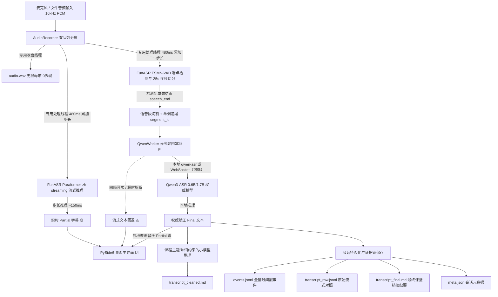

# 课堂实时转写系统 (Hybrid 2-Pass Real-Time Classroom ASR)

一个面向 Windows、macOS、Linux 的低延迟、高准确率“混合 2-Pass 课堂实时语音转写”桌面应用。

---

## 🌟 核心设计理念 (Hybrid 2-Pass)

1. **第一遍追速度（流式 Partial 字幕）**：
   - 麦克风 16kHz 音频流以 100ms (1600 samples) 块摄入，由内部 **480ms (7680 samples) 步长累加器**驱动 **FunASR Paraformer-zh-streaming** (CPU 推理)。
   - 步长延迟 ~150ms，以瀑布流形式立即在 UI 展示实时 Partial 字幕（黄色标签）。
2. **第二遍保准确（离线 Final 权威纠错）**：
   - 说话停顿由 **FunASR FSMN-VAD** 自动检测断句并切分单句音频段；对超长持续语音（>25s）采用**无损连续性切分**（Keep `in_speech=True`），零采样点丢失。
   - 异步送入用户在模型管理器中选定的本地 **Qwen3-ASR 0.6B/1.7B**；也可继续使用 CapsWriter WebSocket 服务，具体 CPU/GPU 加速取决于后端。
   - 将该句的实时 Partial 字幕**精准原地覆盖替换**为权威定稿（🟢 绿色徽标：`✨ Qwen3-ASR 权威纠错`）。
   - 若 Qwen 服务异常或超时，自动优雅回退为流式候选文本（🟠 橙色徽标：`⚠️ 实时回退 (Paraformer)`），永不阻塞或丢失数据。
3. **多线程异步解耦与双队列生产级架构**：
   - `AudioRecorder` 采用双队列分离设计：`_capture_queue` 由专用落盘线程以高优先级写入无损 WAV；`_processing_queue` 由专用 ASR 线程消费并分发至 VAD 与流式识别器，彻底杜绝主音频回调阻塞与丢帧。
   - 采用单调递增 `segment_id` 防止乱序错位。
4. **完整交付物与证据链存证**：
   - 每次课堂结束后自动保存至 `sessions/<session_id>/`：
     - `audio.wav`：16kHz 16-bit 单声道无损录音母带（严格零丢帧保证）。
     - `events.jsonl`：逐毫秒记录的录音、VAD切分、流式输出、离线替换全量事件链。
     - `transcript_raw.jsonl`：流式中间文本 vs Qwen 最终纠错文本对比。
     - `transcript_final.md`：未经删改的权威识别稿，带 `[HH:MM:SS]` 精确时间戳。
     - `transcript_cleaned.md`：录音结束后由本地小模型依据课程名/热词删除口头禅和明显无关闲聊的课程整理稿。
     - `generated_hotwords.json`：本次会话实际使用的热词及自动生成结果。
     - `meta.json`：会话元数据（课程、时长、模型版本、整理模型、成功率与回退统计）。

---

## 🏗️ 架构流程图



---

## 📁 目录结构

```text
├── app/
│   ├── audio/              # 音频录制、双队列分离与音频源抽象 (Microphone / FileReplay)
│   │   ├── recorder.py
│   │   └── source.py
│   ├── config.py           # 全局配置、硬件参数与路径定义
│   ├── model_manager.py    # ModelScope 模型下载/导入/切换/删除
│   ├── courses/            # 课程与专业词库管理
│   │   └── course_manager.py
│   ├── offline/            # Qwen3-ASR、整理模型与具备超时回退机制的异步任务队列
│   │   ├── qwen_adapter.py
│   │   ├── qwen_worker.py
│   │   └── summary_processor.py
│   ├── pipeline/           # 2-Pass 流水线主调度器、平稳停机与会话归档
│   │   └── session_manager.py
│   ├── streaming/          # Paraformer 480ms 累加器流式识别器
│   │   └── paraformer_streamer.py
│   ├── ui/                 # PySide6 现代桌面界面
│   │   └── main_window.py
│   ├── vad/                # FunASR FSMN-VAD 端点检测与 25s 连续切分器
│   │   └── vad_detector.py
│   └── main.py             # 应用程序启动入口
├── courses/                # 预设课程配置与热词文件
│   ├── microeconometrics/
│   ├── political_economy/
│   └── stata/
├── docs/                   # 技术评审方案与验证报告
│   ├── CODE_REVIEW_FIX_PLAN_2026-09-07.md
│   └── FIX_VALIDATION_2026-09-07.md
├── launcher/               # Windows 启动脚本与桌面快捷方式生成器
│   ├── create_shortcut.py
│   ├── run_app.bat
│   └── run_app.sh
├── tests/                  # 自动化回归与验收测试套件
│   ├── audio_samples/      # 验收测试音频样本
│   ├── test_30min_soak.py
│   ├── test_end_to_end_file_replay.py
│   ├── test_full_acceptance.py
│   ├── test_gui_start_signature.py
│   ├── test_qwen_timeout_and_fallback.py
│   ├── test_shutdown_tail_integrity.py
│   ├── test_streaming_accumulator.py
│   └── test_vad_long_speech_continuation.py
├── requirements.txt
├── requirements-build.txt
├── build.py                # 在当前平台构建 PyInstaller 应用
└── README.md
```

---

## 🚀 运行方式

### 源码运行

Windows：双击 `run.bat`，或执行：
```powershell
.venv\Scripts\python.exe main.py
```

macOS/Linux：
```bash
chmod +x launcher/run_app.sh
launcher/run_app.sh
```

### 打包

PyInstaller 需要在目标平台分别构建（不能在 Windows 直接生成 macOS/Linux 二进制）：
```bash
python -m pip install -r requirements-build.txt
python build.py
```
Windows/Linux 构建使用 `--onefile`，Windows 产物是可直接双击的 `dist/ClassroomASR.exe`；macOS 构建会生成可分发的 `dist/ClassroomASR.dmg`。不需要再运行 Python 脚本。便携版首次启动会让用户选择课程笔记目录和模型目录；模型权重不会被塞入程序，课程、设置和录音保存在所选目录。

### 模型与提示词配置

`config/settings.json` 可配置（CapsWriter 路径建议使用环境变量 `CAPSWRITER_DIR` 或填写当前平台路径，不要复制其他平台的盘符；还支持 `CLASSROOM_ASR_DATA_DIR`、`MODELSCOPE_CACHE`）：

- `streaming_backend` / `streaming_model` / `streaming_model_path`：第一遍兼容 FunASR 流式接口的中文模型；默认 `funasr` + `paraformer-zh-streaming`。Qwen3-ASR 不冒充真流式。
- `qwen_backend` / `qwen_model_path`：第二遍本地 Qwen3-ASR 或 CapsWriter WebSocket 配置。
- `asr_prompt`：全局提示词。为空时自动使用当前课程名称；课程 YAML 也可写 `asr_prompt`。
- `auto_generate_hotwords`：使用本地小模型（默认已下载的 Qwen3-0.6B，也兼容 Ollama 的 `qwen3:0.6b`）从课程名/简介补充热词；模型不可用时使用规则兜底词表。
- `summary_enabled`、`summary_endpoint`、`summary_model`、`summary_model_path`：录音结束后的整理开关和本地小模型配置。
- `model_download_workers` / `model_download_max_parallel`：每个模型内部的并行分片线程数和同时下载的模型数，默认 `8` / `4`。

启动应用后点击顶部【🧠 模型】，可以多选并行下载/启用 Qwen3-ASR 0.6B、Qwen3 0.6B、Paraformer 中文流式模型，也可以导入本地模型或删除应用下载的模型。首次启动会在后台并行检查并下载默认模型。ModelScope Hub 会对大文件进行并行分片下载。

默认整理后端直接加载已下载的 Qwen3-0.6B（Transformers）；若使用 Ollama，可执行 `ollama pull qwen3:0.6b` 并把 `summary_provider` 改为 `ollama`。也可以改为 `openai_compatible`，指向 LM Studio/vLLM 等本地接口。Qwen3-ASR 语音后端由 `qwen-asr` 提供，未能加载时仍会回退到 CapsWriter/Paraformer。

Qwen3-ASR 当前在本项目中作为“停顿后离线第二遍”模型使用；它不是 100ms 真流式模型，因此不建议把它硬切成许多小片段冒充流式。第一遍可以切换为其他兼容 FunASR streaming API 的中文模型，第二遍仍会对完整语音段做权威纠错。没有 CapsWriter/Qwen 服务时，系统会自动回退到流式结果，不影响录音。

---

## 🧪 自动化测试套件

| 测试脚本 | 验证内容 |
| :--- | :--- |
| `tests/test_gui_start_signature.py` | UI 设备选择与默认设备 `device_index=None` 路由正确性 |
| `tests/test_streaming_accumulator.py` | 100ms 摄入 / 480ms 步长累加推理与 RTF 性能 |
| `tests/test_shutdown_tail_integrity.py` | 停机阶段无损排空、尾部音频 0 丢失与完整笔记生成 |
| `tests/test_vad_long_speech_continuation.py` | 连续长语音 25s 连续切分与采样点 100% 守恒 |
| `tests/test_qwen_timeout_and_fallback.py` | 服务异常/超时下有界平稳停机与 `[实时回退]` 机制 |
| `tests/test_end_to_end_file_replay.py` | 真实 Paraformer + 真实 CapsWriter Qwen3-ASR 端到端回放 |
| `tests/test_30min_soak.py` | 连续长音频推流稳定性、队列有界性与内存 RSS 监控 |
| `tests/test_full_acceptance.py` | 核心验收标准综合检验 |

详细验证记录请参见 [FIX_VALIDATION_2026-09-07.md](docs/FIX_VALIDATION_2026-09-07.md) 与 [FIX_VALIDATION_ROUND2_2026-09-07.md](docs/FIX_VALIDATION_ROUND2_2026-09-07.md)。

